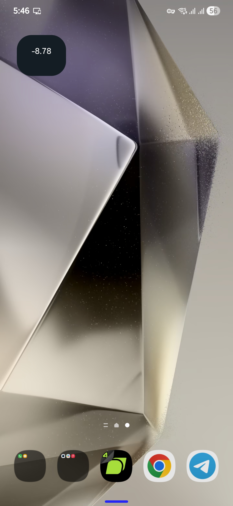
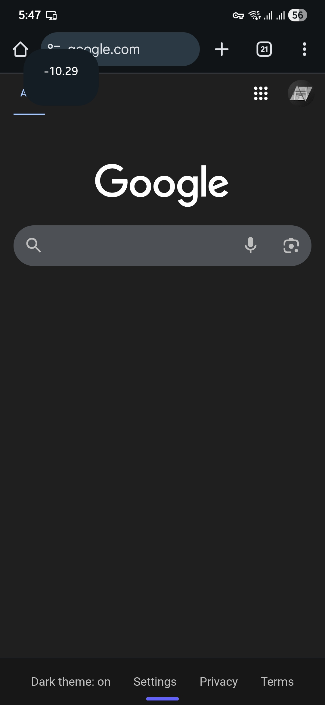

# PNL Watch Display

Real-time crypto unrealized PNL display on Android and Galaxy Watch using Bitunix API.

## How it works
- Python script fetches unrealized PNL from Bitunix Futures
- Bash script runs via Termux + Tasker
- Output is written to a text file and displayed as a system-wide popup
- Notification is mirrored to Galaxy Watch automatically

## Tech
Python · Bash · Termux · Tasker · REST API · Android Notifications

## Security
API keys are read from environment variables and are not stored in the code.

## Demo

### Android Global Overlay
Displayed as a **system-wide popup overlay**, visible on top of any app or screen  
(home screen, browser, messaging apps, etc).

### Galaxy Watch
Live PNL notification mirrored from phone to Galaxy Watch.

- On wrist (real-world usage)
- On desk (clear visibility)

